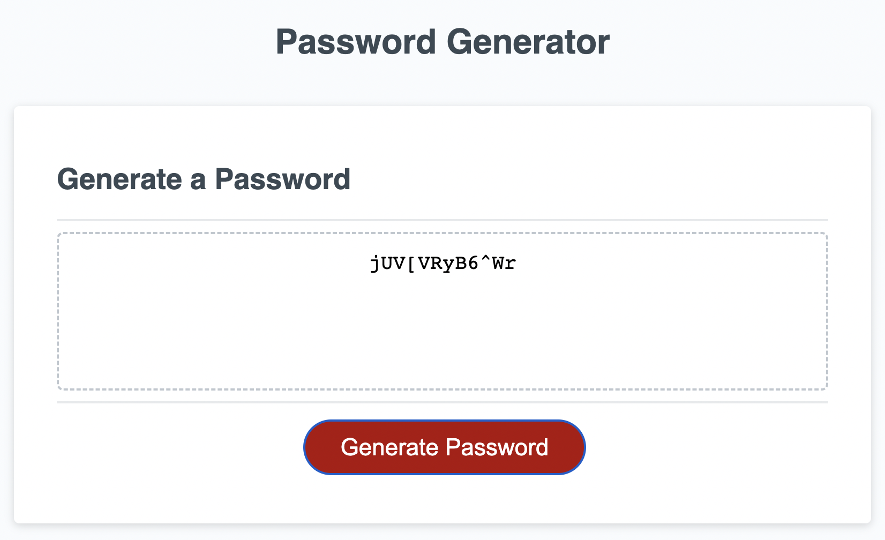

# Your Project Title 

## Technology Used 

| Technology Used         | Resource URL           | 
| ------------- |:-------------:| 
| HTML    | [https://developer.mozilla.org/en-US/docs/Web/HTML](https://developer.mozilla.org/en-US/docs/Web/HTML) | 
| JavaScript | [https://developer.mozilla.org/en-US/docs/Web/JavaScript](https://developer.mozilla.org/en-US/docs/Web/JavaScript)|   
| Git | [https://git-scm.com/](https://git-scm.com/)     |    

<hr>

## Description 

[Visit the Deployed Site](https://jeppjeppjepp0.github.io/PasswordGeneration/)

This project focused on javascript and required students to write functions to prompt a user to randomly generate a password with certain requirements. The full list of acceptance criteria is shown below. 

```md
GIVEN I need a new, secure password
WHEN I click the button to generate a password
THEN I am presented with a series of prompts for password criteria
WHEN prompted for password criteria
THEN I select which criteria to include in the password
WHEN prompted for the length of the password
THEN I choose a length of at least 8 characters and no more than 128 characters
WHEN asked for character types to include in the password
THEN I confirm whether or not to include lowercase, uppercase, numeric, and/or special characters
WHEN I answer each prompt
THEN my input should be validated and at least one character type should be selected
WHEN all prompts are answered
THEN a password is generated that matches the selected criteria
WHEN the password is generated
THEN the password is either displayed in an alert or written to the page
```

<hr>

## Table of Contents (Optional)

If your README is very long, add a table of contents to make it easy for users to find what they need.

* [Code Sample](#code-sample)
* [Usage](#usage)
* [Learning Points](#learning-points)
* [Author Info](#author-info)

<hr>

## Code Sample

One of the more important functions that I wrote during this project was the lengthPrompt() function that determines the length of the generated password (seen below). This function uses an if else statement with the condition that the user enters a valid number between 8 and 128 characters. If the user fails to do this, they will be re-prompted untill they enter a valid number.

```js
function lengthPrompt() {
    userLength = prompt("Enter a password length between 8-128 characters");
    if (userLength >= 8 && userLength <= 128) {
        passLength = userLength;
    }
    else {
        alert("Please enter a value between 8-128");
        lengthPrompt();
    }
}
```

Another important function from this project was the charsPrompt() function that determined what characters are to be included in the randomly generated password. The user is prompted to confirm what characters they would like to use through confirm prompts. If they select 'ok', the given characters are added to a list using the .concat() method. Based on their answer, they are also alerted of their choice to add or deny a given set of characters.

```js
if (confirm("Include uppercase letters?")) {
        charIncluded.incUpper = true; // later used to ensure at least one character type is included
        fullCharList = fullCharList.concat(listUpper);
        alert("Uppercase included!");
    } else {
        alert("No uppercase!");
    }
```

<hr>

## Usage 

The following image is the randomly generated result of a password 12 characters in length with all characters included.



Upon clicking the 'Generate Password' button, users will be prompted to enter a length for the password they would like to generate (between 8-128 characters). If they do not answer within the given range, they will be re-prompted until they succeed. Next, the user will be given a series of confirm messages to include certain types of characters in the random password. If none of the characters are selected by the end of the series, the user is alerted and re-prompted to include at least one type of character. Finally, after all prompts are answered valid, the random password is generated and is printed to the text box on screen.

<hr>

## Learning Points 

Below are the following topics/methods that I learned through this project:

 * [prompt()](https://www.w3schools.com/jsref/met_win_prompt.asp)
 * [alert()](https://www.w3schools.com/jsref/met_win_alert.asp)
 * [confirm()](https://www.w3schools.com/jsref/met_win_confirm.asp)
 * [Array.concat()](https://developer.mozilla.org/en-US/docs/Web/JavaScript/Reference/Global_Objects/Array/concat)
 * [general javascript functions](https://developer.mozilla.org/en-US/docs/Web/JavaScript/Reference/Functions)
 * [if, else, else if javascript](https://www.w3schools.com/js/js_if_else.asp)
 * [for loops javascript](https://www.w3schools.com/js/js_loop_for.asp)
 * [random number generation (Math.random())](https://developer.mozilla.org/en-US/docs/Web/JavaScript/Reference/Global_Objects/Math/random)

<hr>

## Author Info


### Jedd Javier

* [LinkedIn](https://www.linkedin.com/in/jedd-javier-4b323426b/)
* [Github](github.com/jeppjeppjepp0)